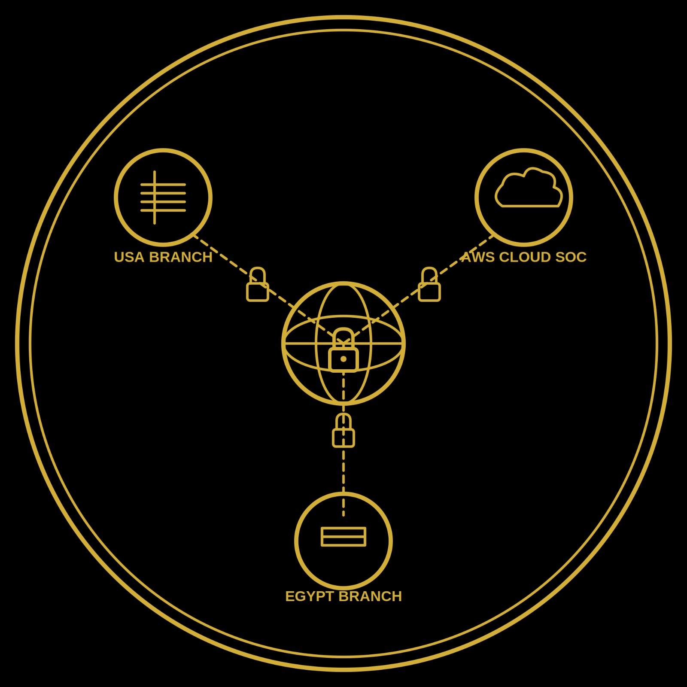

# 🌐 Enterprise Network Infrastructure and Security (ENIS) Project 🛡️

  

## 📑 Executive Overview
This repository hosts the complete design, configuration, and documentation of a highly scalable and secure enterprise network topology. Developed as a final-year graduation project by an Information Technology Graduate from Assiut Technological University, the **ENIS Project** demonstrates a deep understanding of modern networking paradigms. It successfully bridges the gap between complex routing/switching infrastructure and advanced cybersecurity operations, delivering a robust, highly available, and deeply monitored enterprise environment.

## 🏗️ Network Architecture & Geographic Topology
The physical and logical topology is built upon a scalable, multi-site architecture comprising three distinct regional branches, ensuring seamless and secure inter-branch communication:
* **Cairo Headquarters (HQ):** Serving as the central administrative and operational core, structured around the `172.16.40.0/24` network block.
* **USA Branch:** A remote enterprise site leveraging the `172.16.30.0/24` block. It is securely integrated with the HQ via heavily encrypted **Site-to-Site IPsec VPN tunnels**, ensuring data confidentiality and integrity across public WAN links.
* **Cloud Branch:** A simulated modern hybrid-cloud infrastructure, hosting critical centralized services and demonstrating the seamless integration of on-premise networks with cloud-based resources.

## 🧮 Strategic IP Addressing & Subnetting (IPAM)
To ensure optimal routing and strict security boundaries, a highly structured IP allocation strategy was implemented:
* **Core Address Space:** The enterprise operates on a Class B Private IP range (`172.16.0.0/16`).
* **Subnetting Methodology:** A meticulous Fixed-Length Subnet Mask (FLSM) using a `/27` prefix (`255.255.255.224`) is strictly enforced within the main branches.
* **Micro-Segmentation & Scalability:** This specific `/27` allocation strategically confines each departmental broadcast domain to exactly 30 usable host IP addresses. This minimizes broadcast storms and tightens the lateral security perimeter.
* **Standardized VLAN Architecture:** The network is intelligently segmented into role-based VLANs across all branches to enforce strict access controls:
  * `VLAN 10` : Management 
  * `VLAN 20` : Human Resources (HR)
  * `VLAN 30` : Information Technology (IT)
  * `VLAN 40` : Finance & Accounting
  * `VLAN 50` : Sales
  * `VLAN 60` : Public Relations (PR)
  * `VLAN 70` : Customer Service
  * `VLAN 80` : Core Infrastructure Servers

## ⚙️ Automated & Optimized DHCP Infrastructure
To eliminate manual IP configuration errors and streamline endpoint onboarding, a highly optimized DHCP architecture was engineered:
* **Lightweight OS Deployment:** Instead of resource-heavy servers, Alpine Linux was strategically chosen for its minimal footprint to host the centralized DHCP services, optimizing the overall simulation performance.
* **Reliable Daemon:** The native Alpine package manager was utilized to deploy the ISC DHCP server daemon (`dhcp-server-vanilla`) for maximum stability.
* **WAN Traffic Optimization:** The architecture utilizes localized, branch-specific DHCP servers. This crucial design choice prevents heavy DHCP broadcast traffic from traversing and congesting the inter-branch WAN links.

## 🛡️📊 Cybersecurity Operations & Centralized Monitoring (SOC / SIEM)
A core objective of the ENIS project is maintaining absolute visibility and strict security governance over the infrastructure.

### Proactive Infrastructure Monitoring (Zabbix)
* **Core System:** Deployed **Zabbix (Version 7.4.10)** for holistic, real-time network observability.
* **Deep Telemetry:** Extensive utilization of SNMP polling to continuously extract performance metrics from critical routing and switching nodes (e.g., `Cisco_ASA_Core`, `Switch_Servers`).
* **Granular Incident Detection:** Configured advanced triggers to instantly detect resource anomalies, such as high memory exhaustion (>90% sustained for 5 minutes) on critical firewall instances.
* **Automated Incident Response:** Engineered a **Telegram Webhook API integration** that pushes critical Zabbix alerts directly to the Administrator's mobile device. This drastically reduces the Mean Time to Respond (MTTR).

### SIEM & Perimeter Security Policies
* **Advanced Threat Detection:** Seamlessly integrated **Splunk** and **Wazuh** within the Cloud Branch for centralized log aggregation, real-time security event correlation, and advanced threat hunting.
* **Multi-Vendor Perimeter Defense:** Engineered and enforced strict, granular Access Control Lists (ACLs) and stateful firewall inspection policies across a multi-vendor perimeter utilizing both **Cisco ASA** and **Fortinet (FortiGate)** enterprise firewalls.

## 📁 Repository Structure & Full Project Download
This repository is meticulously organized to reflect professional documentation standards:

* 📥 **[Download Full ENIS GNS3 Project - 500MB](https://drive.google.com/drive/folders/1QQmz8R3WnFAKLOx7f0HfDJWYEEtHLPvG?usp=sharing)** -> Access the complete, integrated simulation environment containing all topologies and embedded device images.
* `/Topologies` : High-resolution logical and physical network diagrams illustrating the multi-site connectivity.
* `/Configurations` : Comprehensive, ready-to-deploy backup configuration files for Cisco routers/switches, Cisco ASA, and FortiGate firewalls.
* `/Monitoring_and_Security` : Automation scripts and configuration snippets essential for deploying Zabbix, Splunk, Wazuh, and the Telegram API webhook.
* `/Documentation` : In-depth technical guides detailing the implementation phases across the three regional branches.
* `/Photo_of_Project` : A visual showcase containing screenshots of live network simulations, active firewall policies, and real-time SIEM/Monitoring dashboards.

## 📬 Let's Connect & Discuss
I am an Information Technology Graduate passionate about network engineering and proactive cybersecurity operations. If you are interested in discussing the technical intricacies of this project or exploring professional opportunities, I would be glad to connect!

* **Professional Network:** [Connect with me on LinkedIn and view the project showcase post](https://www.linkedin.com/posts/beshoy-hendi_graduationproject-cybersecurity-networksecurity-ugcPost-7484109884024721408-054S/?utm_source=share&utm_medium=member_desktop&rcm=ACoAAEYbhcMBE4qe5itbCWplJRzPtK9nHwUEPVk)
* **Email:** [Your Email Address](mailto:beshoyhenday2002@gmail.com)
